# PixelBatch


**PixelBatch** is a powerful, user-friendly desktop application for batch image optimization on Linux. Optimize hundreds of images at once while preserving quality, reducing file sizes, and saving disk space.

## 📸 Screenshots

<p align="center">
  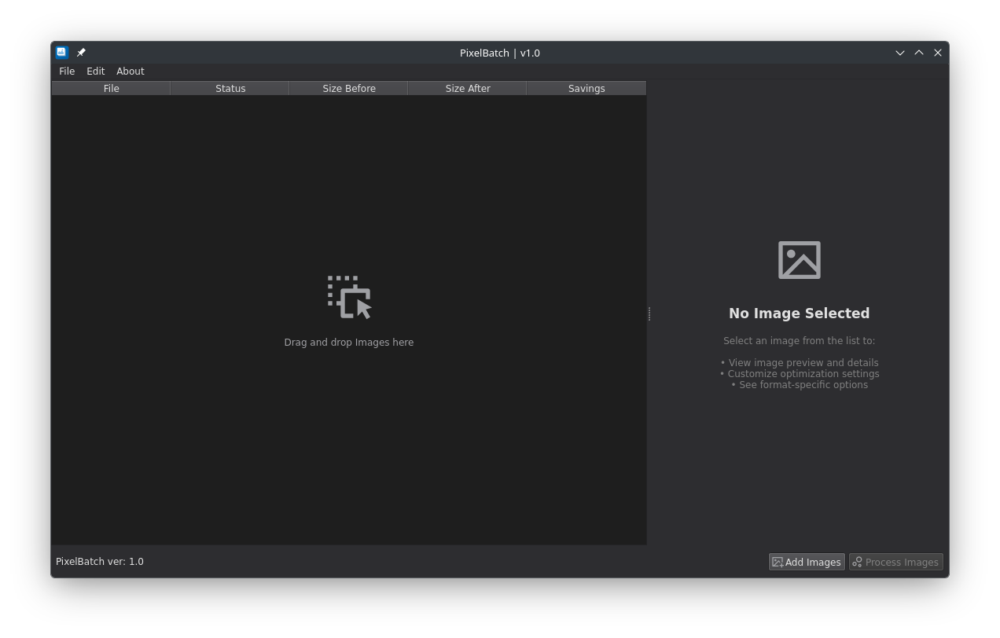
  <br>
  <em>Main Interface - Batch image optimization with real-time statistics</em>
</p>

<p align="center">
  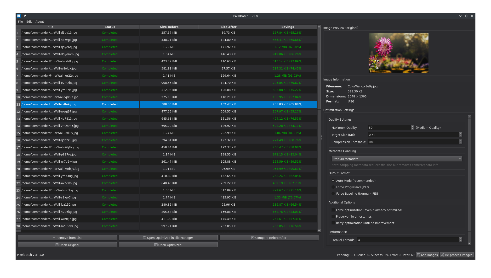
  <br>
  <em>Optimizer Settings - Fine-tune compression for each format</em>
</p>

<details>
<summary><strong>📷 View More Screenshots</strong> (click to expand)</summary>
<br>

<table>
  <tr>
    <td width="50%">
      <a href="screenshots/PixelBatch-Linux-3.png" target="_blank">
        
      </a>
    </td>
    <td width="50%">
      <a href="screenshots/PixelBatch-Linux-4.png" target="_blank">
        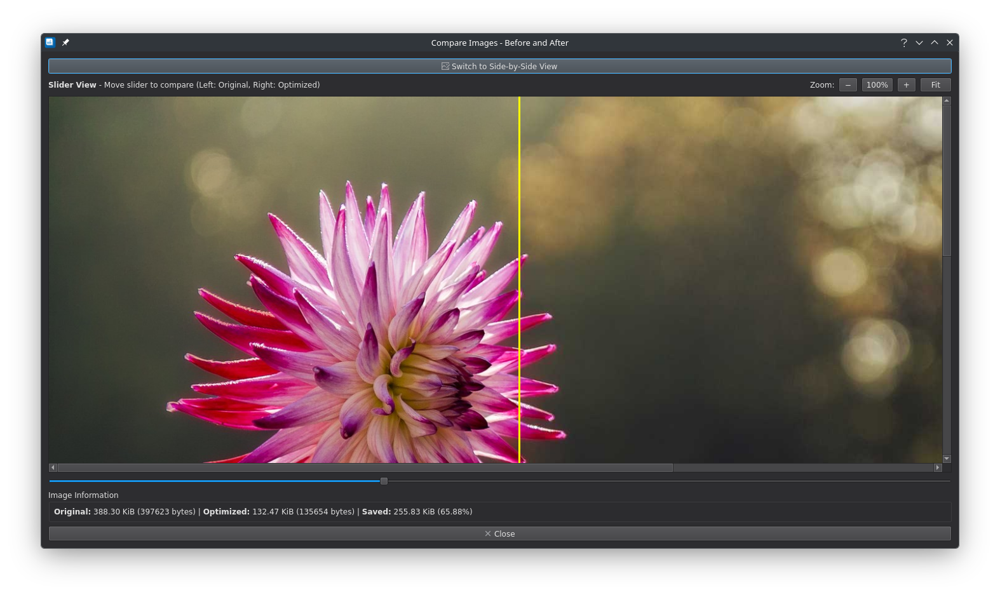
      </a>
    </td>
  </tr>
  <tr>
    <td width="50%">
      <a href="screenshots/PixelBatch-Linux-5.png" target="_blank">
        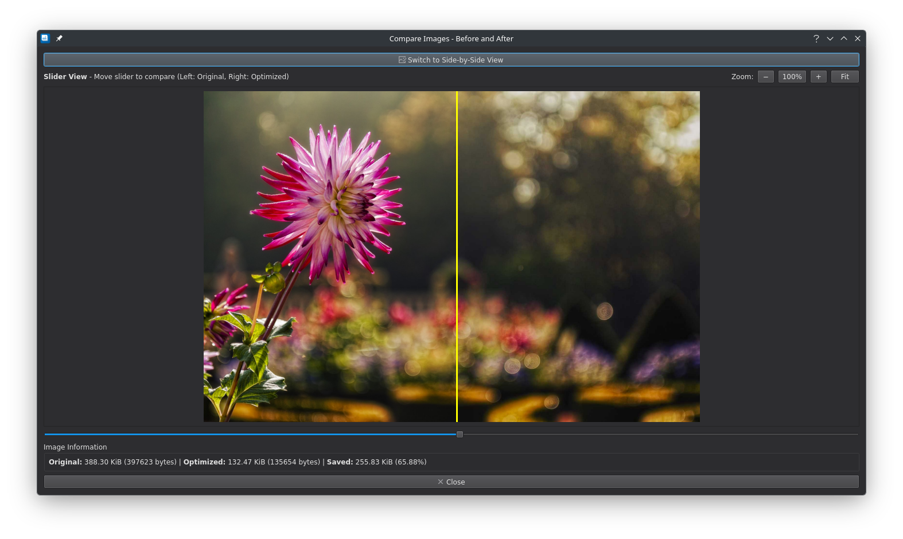
      </a>
    </td>
    <td width="50%">
      <a href="screenshots/PixelBatch-Linux-6.png" target="_blank">
        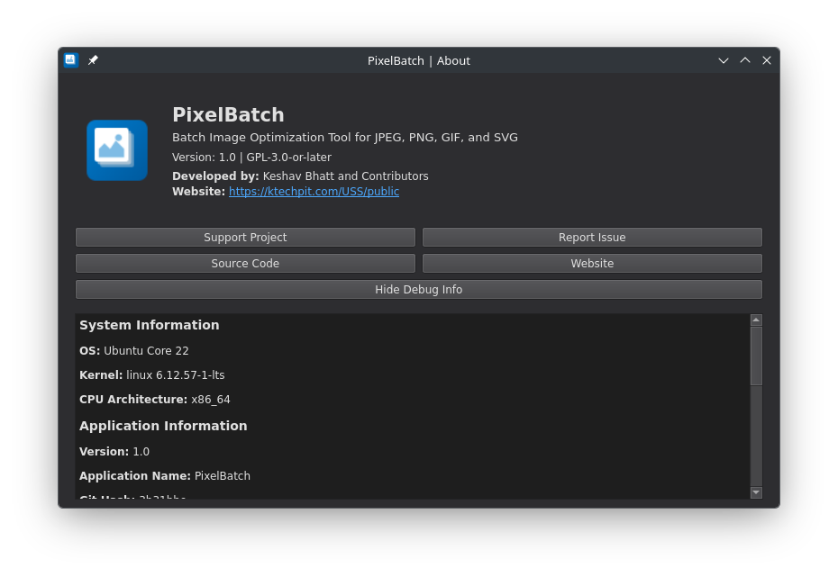
      </a>
    </td>
  </tr>
  <tr>
    <td width="50%">
      <a href="screenshots/PixelBatch-Linux-7.png" target="_blank">
        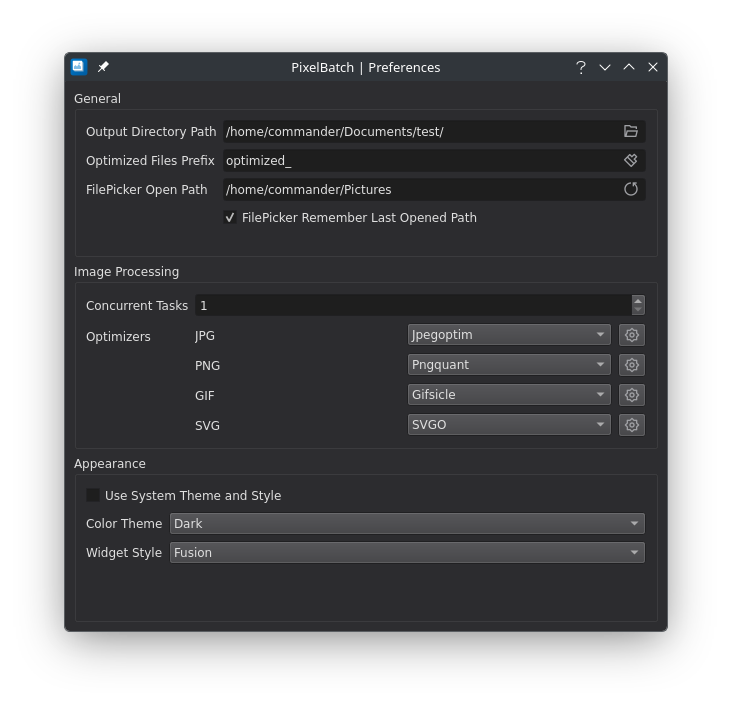
      </a>
    </td>
    <td width="50%">
      <a href="screenshots/PixelBatch-Linux-8.png" target="_blank">
        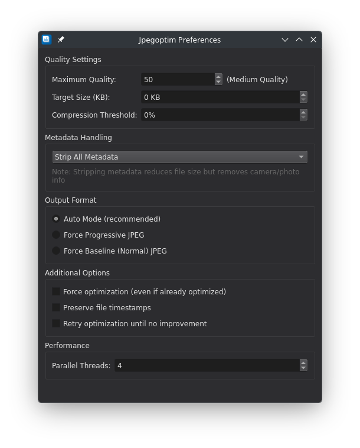
      </a>
    </td>
  </tr>
  <tr>
    <td width="50%">
      <a href="screenshots/PixelBatch-Linux-9.png" target="_blank">
        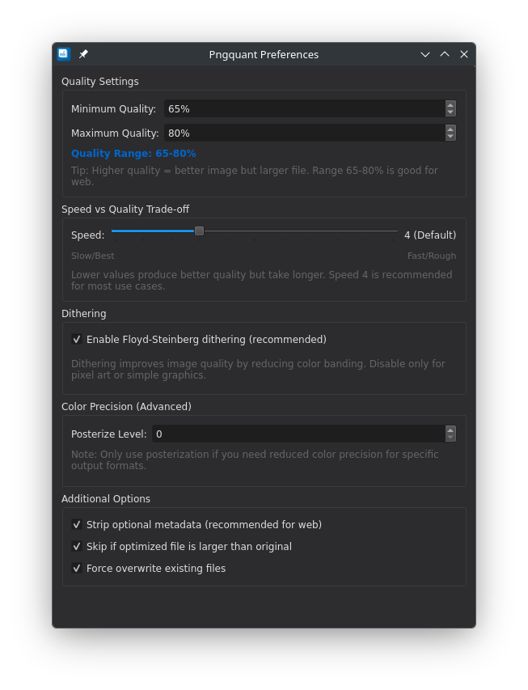
      </a>
    </td>
    <td width="50%">
      <a href="screenshots/PixelBatch-Linux-10.png" target="_blank">
        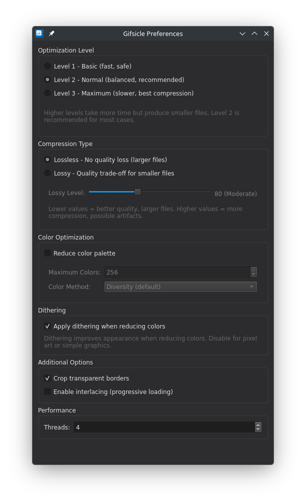
      </a>
    </td>
  </tr>
  <tr>
    <td width="50%">
      <a href="screenshots/PixelBatch-Linux-11.png" target="_blank">
        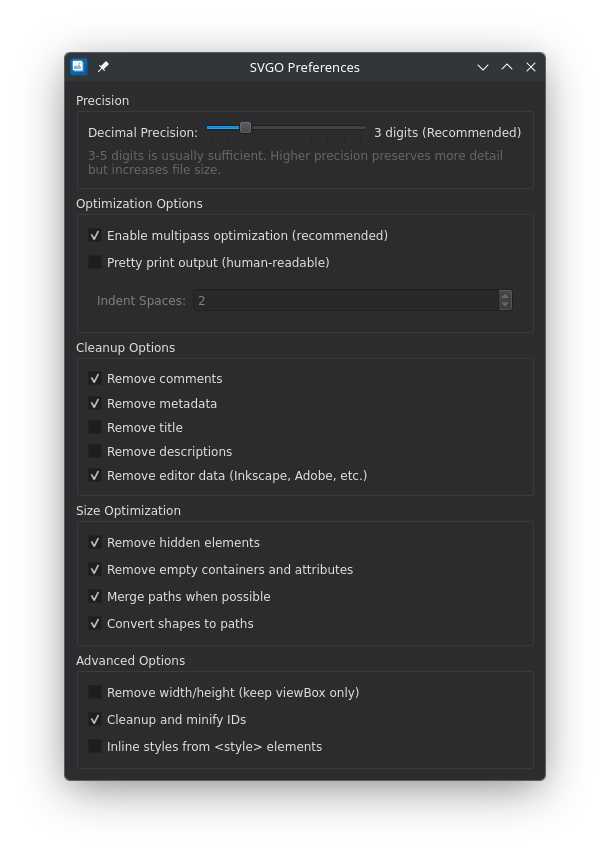
      </a>
    </td>
    <td width="50%">
      <a href="screenshots/PixelBatch-Linux-12.png" target="_blank">
        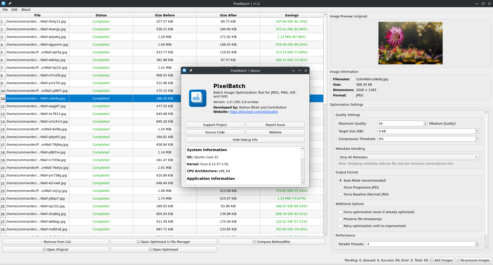
      </a>
    </td>
  </tr>
</table>

</details>

## ✨ Features

- **🚀 Batch Processing**: Optimize multiple images simultaneously with configurable concurrent task limits
- **📁 Drag & Drop**: Simply drag images into the application to add them to the queue
- **🖼️ Multiple Formats**: Support for JPEG, PNG, GIF, and SVG images
- **⚡ Parallel Processing**: Process multiple images concurrently for maximum efficiency
- **📊 Real-time Statistics**: See original size, optimized size, and savings for each image
- **🎯 Lossless Optimization**: Reduce file size without quality loss using industry-standard tools
- **⚙️ Configurable**: Customize output paths, file prefixes, and optimization settings
- **📈 Progress Tracking**: Monitor the status of each task (Pending, Processing, Completed, Error)
- **🔍 Quick Actions**: Open optimized images directly from the application
- **💾 Smart Defaults**: Remembers your last used directories and preferences

## 🎯 Use Cases

- **Web Developers**: Optimize images for faster website loading times
- **Photographers**: Reduce storage requirements for image collections
- **Content Creators**: Prepare images for social media and online platforms
- **System Administrators**: Batch process server assets and reduce bandwidth usage
- **Designers**: Optimize graphics while maintaining quality

## 📦 Installation

### From Source

#### Prerequisites

Make sure you have the following dependencies installed:

```bash
# Ubuntu/Debian
sudo apt-get install qt5-default build-essential

# Required optimization tools
sudo apt-get install jpegoptim pngquant gifsicle

# SVGO (requires Node.js)
sudo apt-get install npm
sudo npm install -g svgo

# Note: pngquant 3.0+, gifsicle 1.9+, and SVGO 3.0+ recommended for best results
```

#### Build Instructions

```bash
# Clone the repository
git clone https://github.com/keshavbhatt/PixelBatch.git
cd PixelBatch/src

# Build the application
qmake PixelBatch.pro
make

# Run the application
./pixelbatch
```

#### System-wide Installation

```bash
# Install to /usr/local (default)
sudo make install

# Or install to custom prefix
qmake PREFIX=/opt/pixelbatch PixelBatch.pro
make
sudo make install
```

### Snap Package

```bash
# Install from Snap Store (coming soon)
snap install pixelbatch
```

### Flatpak Package

```bash
# Install from Flathub (coming soon)
flatpak install flathub com.ktechpit.pixelbatch

# Run the application
flatpak run com.ktechpit.pixelbatch
```

#### Building Flatpak Locally

If you want to build and test the Flatpak package locally:

```bash
# Install flatpak-builder
sudo apt-get install flatpak-builder

# Add Flathub repository (if not already added)
flatpak remote-add --if-not-exists flathub https://flathub.org/repo/flathub.flatpakrepo

# Install KDE runtime and SDK
flatpak install flathub org.kde.Platform//5.15-23.08 org.kde.Sdk//5.15-23.08

# Build the Flatpak
flatpak-builder --force-clean --user --install build-dir com.ktechpit.pixelbatch.yml

# Run the locally built Flatpak
flatpak run com.ktechpit.pixelbatch
```


## 🚀 Quick Start

### Basic Usage

1. **Launch PixelBatch** from your application menu or terminal
2. **Add Images**:
   - Click "Add Images" button, or
   - Drag and drop image files directly into the window
3. **Configure Settings** (optional):
   - Set output directory for optimized images
   - Configure file naming prefix
   - Adjust concurrent task limit
   - Customize optimizer settings (Edit → Optimizer Settings)
4. **Start Processing**:
   - Click "Process Images" button
   - Watch real-time progress for each image
5. **View Results**:
   - See file size reduction statistics
   - Right-click tasks for quick actions (open, view, remove)
6. **Re-process Images** (optional):
   - Change optimizer settings if needed
   - Click "Re-process Images" to optimize again with new settings
   - Useful for testing different quality/compression levels

### Supported Image Formats

| Format | Extension | Optimizer Used | Compression Type |
|--------|-----------|----------------|------------------|
| JPEG   | `.jpg`, `.jpeg` | jpegoptim | Lossless or Lossy |
| PNG    | `.png` | pngquant | Lossy with quality control |
| GIF    | `.gif` | gifsicle | Lossless or Lossy |
| SVG    | `.svg` | SVGO | Lossless (code optimization) |

## ⚙️ Configuration

### Settings Panel

Access settings through **Preferences** menu:

- **Output Path**: Directory where optimized images will be saved
  - Default: `~/Pictures/optimized/`
- **File Prefix**: Prefix added to optimized filenames
  - Default: `optimized_`
  - Example: `image.jpg` → `optimized_image.jpg`
- **Max Concurrent Tasks**: Number of images to process simultaneously
  - Default: 4
  - Recommended: Number of CPU cores
- **Remember Last Directory**: Auto-open last used directory when adding files

### Format-Specific Settings

#### JPEG Optimization

Access JPEG settings through **Edit → Optimizer Settings → JPEG**:

**Quality Settings:**
- **Maximum Quality** (0-100):
  - 100 = Lossless optimization (no quality loss)
  - 90-99 = High quality with some compression
  - 75-89 = Good quality, balanced compression
  - Below 75 = Higher compression, noticeable quality reduction
  - Recommendation: 90-95 for web, 100 for archival

- **Target Size**: Optimize images to a specific file size in KB
  - Useful for meeting file size requirements
  - Example: Set to 100 KB for profile pictures
  - Note: Overrides quality setting

- **Compression Threshold**: Skip optimization if savings are below this percentage
  - Example: Setting to 5% skips files with less than 5% size reduction
  - Helps avoid processing already-optimized images

**Metadata Handling:**
- **Keep All Metadata**: Preserves camera info, GPS, copyright (larger files)
- **Strip All Metadata**: Removes all metadata (smallest files)
- **Keep EXIF Only**: Preserves camera settings, dates
- **Keep ICC Profile Only**: Preserves color profile for accurate display
- **Keep EXIF + ICC**: Best balance for photographers
- Note: Stripping metadata can reduce file size by 5-30%

**Output Format:**
- **Auto Mode** (Recommended): Automatically chooses best format
- **Force Progressive**: Better for web (loads gradually)
- **Force Baseline**: Better compatibility with older software

**Additional Options:**
- **Force Optimization**: Re-optimize even if already optimized
- **Preserve Timestamps**: Keep original file dates
- **Retry Until No Improvement**: Multiple optimization passes (slower but better compression)

**Performance:**
- **Parallel Threads**: CPU threads per image (1-16)
  - More threads = faster but more CPU usage
  - Recommended: 1-2 for most users

#### PNG Optimization

Access PNG settings through **Edit → Optimizer Settings → PNG**:

**Quality Settings:**
- **Minimum Quality** (0-100%, default: 65%):
  - Don't save if quality falls below this level
  - Prevents over-compression
  - Lower = more compression risk
  
- **Maximum Quality** (0-100%, default: 80%):
  - Use fewer colors to stay below this quality
  - Higher = better quality but larger files
  - Recommendation: 65-80% for web, 80-95% for archival

**Speed vs Quality:**
- **Speed Slider** (1-11, default: 4):
  - 1 = Slowest processing, best quality
  - 4 = Balanced (recommended)
  - 11 = Fastest processing, rougher quality
- Note: Lower speeds produce better results but take longer

**Dithering:**
- **Enable Floyd-Steinberg Dithering** (default: enabled):
  - Creates smoother gradients
  - Reduces color banding
  - Recommended for photos and graphics
  - Disable only for pixel art or simple images

**Color Precision (Advanced):**
- **Posterize Level** (0-8, default: 0):
  - Reduces color precision
  - Use only for specific output formats (e.g., ARGB4444)
  - 0 = disabled (recommended for most users)

**Additional Options:**
- **Strip Metadata**: Remove optional chunks (reduces file size)
- **Skip if Larger**: Keep original if optimization makes file bigger
- **Force Overwrite**: Always overwrite existing output files

**Compression Performance:**
- Typical savings: 40-70% file size reduction
- Uses lossy compression with quality control
- Much more effective than lossless PNG optimization

#### GIF Optimization

Access GIF settings through **Edit → Optimizer Settings → GIF**:

**Optimization Level:**
- **Level 1**: Basic optimization (fast, safe)
- **Level 2**: Normal optimization (balanced, recommended)
- **Level 3**: Maximum optimization (slower, best compression)

**Compression Type:**
- **Lossless**: No quality loss (10-30% reduction)
  - Safe for all GIFs, including animations
- **Lossy**: Quality trade-off for smaller files (30-60% reduction)
  - **Lossy Level** (1-200, default: 80):
    - Lower = better quality, larger files
    - Higher = more compression, possible artifacts
    - Recommendation: 60-100 for web

**Color Optimization:**
- **Reduce Color Palette**: Checkbox to enable color reduction
  - **Maximum Colors** (2-256, default: 256)
  - **Color Method**: Diversity (default), Blend Diversity, Median Cut
- Reduces palette size for much smaller files

**Dithering:**
- **Apply Dithering**: Enabled by default
  - Creates smoother gradients when reducing colors
  - Disable only for pixel art or simple graphics

**Additional Options:**
- **Crop Transparent Borders**: Remove transparent edges (recommended)
- **Enable Interlacing**: Progressive loading (good for web)

**Performance:**
- **Threads** (1-16, default: 4): Multi-threaded processing

**Compression Performance:**
- Lossless: 10-30% reduction
- Lossy: 30-60% reduction
- Lossy + Color reduction: 50-80% reduction
- Works with both static and animated GIFs

#### SVG Optimization

Access SVG settings through **Edit → Optimizer Settings → SVG**:

**Precision:**
- **Decimal Precision** (1-10 digits, default: 3):
  - Controls rounding of coordinates
  - Lower = smaller files but less precise
  - Higher = larger files but more precise
  - Recommendation: 3-5 digits for most use cases

**Optimization Options:**
- **Multipass Optimization**: Enabled by default
  - Passes over SVG multiple times for best results
- **Pretty Print**: Disabled by default
  - Makes SVG human-readable with indentation
  - Increases file size but improves editability
  - **Indent Spaces**: 0-8 (default: 2) when pretty print enabled

**Cleanup Options:**
- **Remove Comments**: Enabled by default
- **Remove Metadata**: Enabled by default
- **Remove Title**: Disabled (accessibility)
- **Remove Descriptions**: Disabled (accessibility)
- **Remove Editor Data**: Enabled (Inkscape, Adobe, etc.)

**Size Optimization:**
- **Remove Hidden Elements**: Enabled
  - Removes zero-sized and invisible elements
- **Remove Empty Containers**: Enabled
  - Removes empty groups and attributes
- **Merge Paths**: Enabled
  - Combines multiple paths when possible
- **Convert Shapes to Paths**: Enabled
  - Converts basic shapes to compact path form

**Advanced Options:**
- **Remove Width/Height**: Disabled by default
  - Creates responsive SVG (viewBox only)
- **Cleanup IDs**: Enabled
  - Removes unused IDs and shortens used ones
- **Inline Styles**: Disabled by default
  - Moves styles from `<style>` to inline attributes

**Compression Performance:**
- Typical savings: 30-70% file size reduction
- Lossless optimization (no visual quality loss)
- Safe for logos, icons, and illustrations
- Works with complex SVG files

## 🎨 User Interface

### Main Window Components

1. **Menu Bar**:
   - File: Add images, clear tasks, quit
   - Edit: Preferences, optimizer settings
   - Help: About, documentation

2. **Task Table**:
   - **File Name**: Original image filename
   - **Status**: Current processing state
   - **Size Before**: Original file size
   - **Size After**: Optimized file size
   - **Savings**: Space saved (bytes and percentage)

3. **Status Bar**:
   - Task summary (completed/pending/error counts)
   - Total savings statistics

4. **Action Panel** (shown when task selected):
   - Remove selected task
   - Open optimized image location
   - View optimized image
   - View original image

### Keyboard Shortcuts

- **Ctrl+O**: Add images
- **Ctrl+Q**: Quit application
- **Delete**: Remove selected task
- **Enter/Return**: Open completed image in viewer
- **Escape**: Deselect current selection
- **Ctrl+A**: Select all tasks
- **F5**: Start processing

## 🔧 Advanced Usage

### Command Line Options

```bash
# Specify images to load on startup
pixelbatch image1.jpg image2.png image3.gif

# Open with specific working directory
pixelbatch --dir /path/to/images
```

### Batch Processing Tips

1. **Organize First**: Group similar images for consistent optimization settings
2. **Test Settings**: Process a few images first to verify optimization quality
3. **Re-process with Different Settings**: 
   - After processing, adjust optimizer settings
   - Click "Re-process Images" to try different quality/compression levels
   - Compare results to find optimal settings
4. **Monitor Progress**: Watch for error status to catch problematic files
5. **Check Results**: Compare before/after sizes and quality
6. **Backup Important Files**: Keep originals of critical images

### Performance Optimization

- **Concurrent Tasks**: Set to number of CPU cores for optimal performance
- **Large Batches**: Process in smaller batches if memory is limited
- **SSD Storage**: Save optimized files to SSD for faster I/O
- **Background Processing**: PixelBatch can run in background while you work

## 🐛 Troubleshooting

### Common Issues

#### "Optimizer tool not found" Error
**Solution**: Install required optimization tools:
```bash
sudo apt-get install jpegoptim pngquant
```

#### Images Not Processing
**Possible Causes**:
- Check that optimizer tools are installed
- Verify file permissions on source and destination directories
- Ensure sufficient disk space for optimized images

#### Slow Processing
**Solutions**:
- Reduce max concurrent tasks if system is overloaded
- Close other resource-intensive applications
- Process smaller batches of images

#### Application Won't Start
**Check**:
- Qt libraries are installed (`qt5-default`)
- Run from terminal to see error messages
- Check system logs for conflicts

### Getting Help

- **Documentation**: See [DEVELOPER_README.md](DEVELOPER_README.md) for technical details
- **Issues**: Report bugs on GitHub Issues
- **Community**: Join our discussion forums

## 🤝 Contributing

We welcome contributions! Here's how you can help:

### Ways to Contribute

- 🐛 **Report Bugs**: Open an issue with detailed reproduction steps
- 💡 **Suggest Features**: Share your ideas for improvements
- 📝 **Improve Documentation**: Fix typos, add examples, clarify instructions
- 🔧 **Submit Code**: Fix bugs or implement new features
- 🌍 **Translations**: Help translate PixelBatch to other languages

### Development Setup

See [DEVELOPER_README.md](DEVELOPER_README.md) for comprehensive development documentation including:
- Project structure and architecture
- Coding conventions and patterns
- Build system details
- How to add new features

### Pull Request Process

1. Fork the repository
2. Create a feature branch (`git checkout -b feature/amazing-feature`)
3. Make your changes following our coding conventions
4. Test thoroughly
5. Commit with clear messages (`git commit -m 'Add amazing feature'`)
6. Push to your fork (`git push origin feature/amazing-feature`)
7. Open a Pull Request

## 📋 Requirements

### Runtime Requirements

- **Operating System**: Linux (Ubuntu 18.04+, Debian 10+, or equivalent)
- **Qt**: Version 5.9 or higher
- **Optimization Tools**:
  - jpegoptim (v1.5.0+) - for JPEG optimization
  - pngquant (v2.0+, v3.0+ recommended) - for PNG optimization
  - gifsicle (v1.9+, v1.95+ recommended) - for GIF optimization
  - SVGO (v3.0+, v4.0+ recommended) - for SVG optimization (requires Node.js)

### Build Requirements

- Qt5 development libraries
- C++17 compatible compiler (GCC 7+, Clang 5+)
- qmake build tool
- make

## 📄 License

PixelBatch is licensed under the **GNU General Public License v3.0**.

This means you are free to:
- ✅ Use the software for any purpose
- ✅ Study and modify the source code
- ✅ Share the software with others
- ✅ Distribute modified versions

**See [LICENSE](LICENSE) for full license text.**

## 🙏 Acknowledgments

- **jpegoptim**: Utility to optimize JPEG files
- **pngquant**: Lossy PNG compressor
- **Qt Framework**: Cross-platform application framework
- **Open Source Community**: For continuous inspiration and support

## 📞 Contact & Support

- **Project**: PixelBatch
- **Organization**: ktechpit.com
- **Version**: 1.0
- **Desktop ID**: com.ktechpit.pixelbatch

### Links

- 🏠 **Homepage**: [ktechpit.com](https://ktechpit.com)
- 📚 **Documentation**: [DEVELOPER_README.md](DEVELOPER_README.md)
- 🐛 **Bug Reports**: GitHub Issues
- 💬 **Discussions**: GitHub Discussions

## 🗺️ Roadmap

### Planned Features

- [ ] WebP format support
- [ ] AVIF format support
- [ ] Batch resize operations
- [ ] Image format conversion
- [ ] Custom optimization profiles
- [ ] Before/after image comparison viewer

### Version History

#### v1.0 (Current)
- Initial release
- JPEG, PNG, GIF, SVG support
- Batch processing with concurrent tasks
- Drag & drop interface
- Real-time statistics
- Configurable settings

---

**Made with ❤️ for the Linux community**

*If you find PixelBatch useful, please consider giving it a ⭐ on GitHub!*

